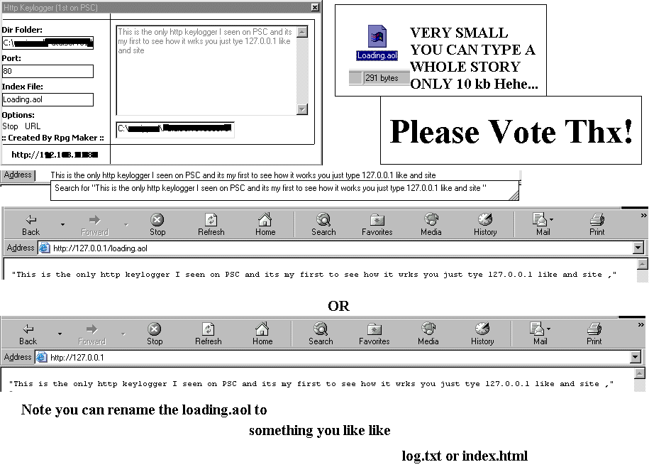



## Http Keylogger \(First on PSC\)

### Description

This is a http keylogger meaning a web server (hosts website and a keylogger) together it takes everything you type and puts in a log file and hosts the log on the net you can test by typing in 127.0.0.1 or Localhost or your ip in the address bar of your Internet Explorer PLEASE VOTE THX!
 
### More Info
 

             |
---                |---
**Submitted On**   |2003-06-11 16:01:04
**By**             |[RPG MAKER](https://github.com/Planet-Source-Code/PSCIndex/blob/master/ByAuthor/rpg-maker.md)
**Level**          |Intermediate
**User Rating**    |3.7 (11 globes from 3 users)
**Compatibility**  |VB 5\.0, VB 6\.0
**Category**       |[Coding Standards](https://github.com/Planet-Source-Code/PSCIndex/blob/master/ByCategory/coding-standards__1-43.md)
**World**          |[Visual Basic](https://github.com/Planet-Source-Code/PSCIndex/blob/master/ByWorld/visual-basic.md)
**Archive File**   |[Http\_Keylo1599706112003\.zip](https://github.com/Planet-Source-Code/rpg-maker-http-keylogger-first-on-psc__1-46113/archive/master.zip)

